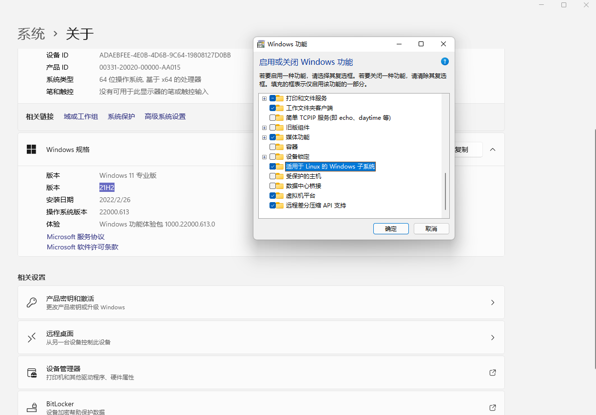
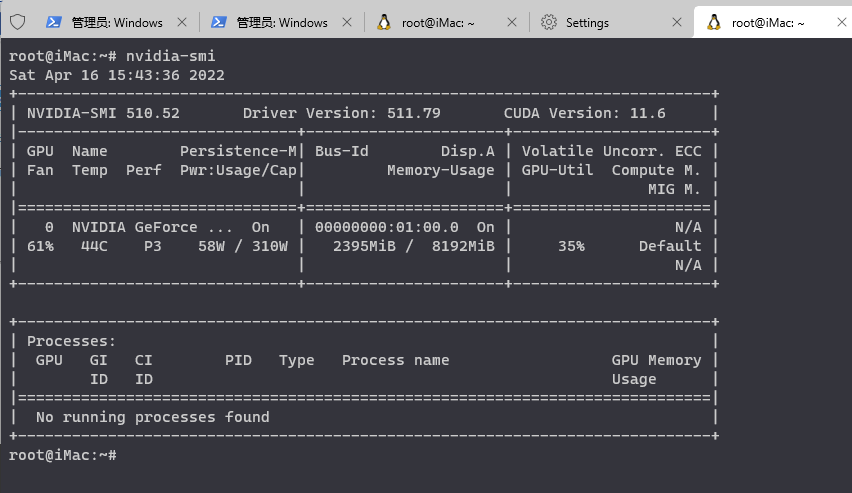

Win11 + WSL2 + cuda + TensorFlow的深度学习开发环境的搭建
===

## 前言

前段时间升级了windows台式机，由于双系统实在过于麻烦，而且现在wsl2已经很成熟了， 可以带来比较好的windows上的开发体验， 但是在环境准备过程中还是有不少坑的， 更具网上的资料和官方文档整理一下, 该文档仅代表win11的环境，win10是否适用不清楚

## 系统环境

- 硬件
  - 12th Gen Intel(R) Core(TM) i7-12700KF
  - 32G 3600
  - RTX3070ti
- 系统
  - Windows11 21H2
  - WSL2
  - Ubuntu2004

## WSL2 Install

1. 开启Windows功能： 系统设置 -> 应用 -> 可选功能 -> 最下边的 「更多 Windows 功能」 -> 找到并勾选 「Hyper-V」和「适用于 Linux 的 Windows 子系统」-> 点击确定
   
 ``` sh
 # 命令行开启虚拟化(如果下面安装过程中报错的话)
 bcdedit /set hypervisorlaunchtype auto
 ```  

***WRAN: 重启电脑***



1. 配置和安装wsl2和ubuntu

``` sh
# Wran: 以管理员身份运行terminal
# 1. 设置版本为wsl2
wsl --set-default-version 2
# 更新wsl
wsl --update
# 查看可安装的Linux版本
wsl --list online
# 安装Ubuntu20.04
wsl --install -d Ubuntu-20.04
```
3. 安装完成后会自动启动Ubuntu, 然后按照提示配置基本信息
   
## Cuda Install

  *首先在windows上去官网下载并安装(更新)显卡驱动*
  
  windows上显卡驱动安装成功以后wsl2下的ubuntu可以使用`nvidia-smi`查看gpu的运行状态(以管理员启动terminal)
  

### 安装Cuda


我测试的时候官方文档推荐的方式是使用cuda-toolkit安装11.4版本, 但是我发现和tensorflow还存在兼容性问题, 所以我选择使用官方安装包安装11.2版本的cuda(后面会接受toolkit的方式)
#### 方法1. 官方cuda包安装
``` sh
# 下载官方cuda安装程序
wget https://developer.download.nvidia.com/compute/cuda/11.2.0/local_installers/cuda_11.2.0_460.27.04_linux.run

# 执行安装程序安装cuda(根据提示操作)
sudo sh cuda_11.2.0_460.27.04_linux.run
```

#### 方法2. cuda-toolkit安装
``` sh
sudo dpkg -i cuda*ubuntu*_amd64.deb
sudo dpkg -i cuda*-cross-aarch64*_all.deb
sudo apt-get update
sudo apt-get install cuda-toolkit-x-x -y
sudo apt-get install cuda-cross-aarch64* -y
```

添加环境变量

``` sh
vim ~/.bashrc

# cuda
export CUDA_HOME="/usr/local/cuda-11.2"
export PATH="${CUDA_HOME}/bin:$PATH"
export LD_LIBRARY_PATH="/usr/local/cuda-11.2/lib64:$LD_LIBRARY_PATH"

source ~/.bashrc
```

### 安装CUDnn
首先去官网下载对应版本的包<https://developer.nvidia.com/rdp/cudnn-archive>(*如果没有nv账号的需要先注册账号*)

``` sh
# 扔到ubuntu上(我选择的是 cudnn-11.2-linux-x64-v8.1.1.33.tgz)
# 解压
tar tar zxvf ./cudnn-11.2-linux-x64-v8.1.1.33.tgz 

# 移动
sudo cp cuda/include/cudnn*.h /usr/local/cuda-11.2/include
sudo cp -P cuda/lib64/libcudnn* /usr/local/cuda-11.2/lib64
sudo chmod a+r /usr/local/cuda-11.2/include/cudnn*.h 
sudo chmod a+r /usr/local/cuda-11.2/lib64/libcudnn*
```

### 安装TensorFlow

**注意:** tensoflow的版本对于cuda和cudnn的版本, 可以去官网查询<https://www.tensorflow.org/install/source#gpu>
(*tensorflow1.0的版本是分gpu和cpu两种的, 而2.0以后就不分了*)
``` sh
# TensorFlow 2
pip3 install tensorflow==2.6.0

# TensorFlow 1需要单独制定gpu的版本, 不过官网显示1.0的版本不兼容python3.8和当前版本的cuda所以我没有做测试
```

### 测试GPU的连接

``` python
import tensorflow as tf

print(tf.test.is_built_with_gpu_support())
print(tf.config.list_physical_devices())


# terminal output
root@iMac:~/susur/PythonProject# python3 -u "/root/susur/PythonProject/tf_test.py"
True
2022-04-18 13:46:52.440924: I tensorflow/stream_executor/cuda/cuda_gpu_executor.cc:923] could not open file to read NUMA node: /sys/bus/pci/devices/0000:01:00.0/numa_node
Your kernel may have been built without NUMA support.
2022-04-18 13:46:52.464878: I tensorflow/stream_executor/cuda/cuda_gpu_executor.cc:923] could not open file to read NUMA node: /sys/bus/pci/devices/0000:01:00.0/numa_node
Your kernel may have been built without NUMA support.
2022-04-18 13:46:52.465102: I tensorflow/stream_executor/cuda/cuda_gpu_executor.cc:923] could not open file to read NUMA node: /sys/bus/pci/devices/0000:01:00.0/numa_node
Your kernel may have been built without NUMA support.
[PhysicalDevice(name='/physical_device:CPU:0', device_type='CPU'), PhysicalDevice(name='/physical_device:GPU:0', device_type='GPU')]
```

这个`ould not open file to read NUMA node:...`的警告是wsl的通病, 官方的解释是无害警告, 可以正常运行;


